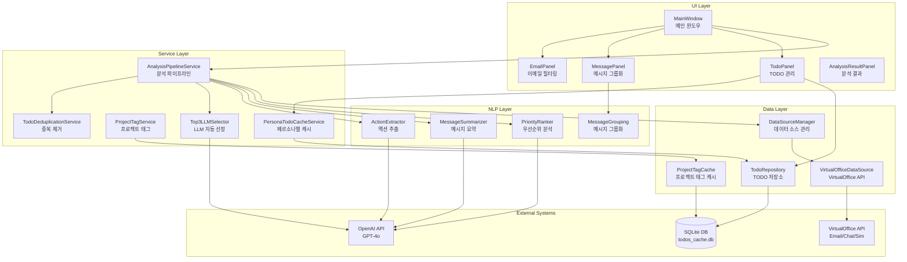
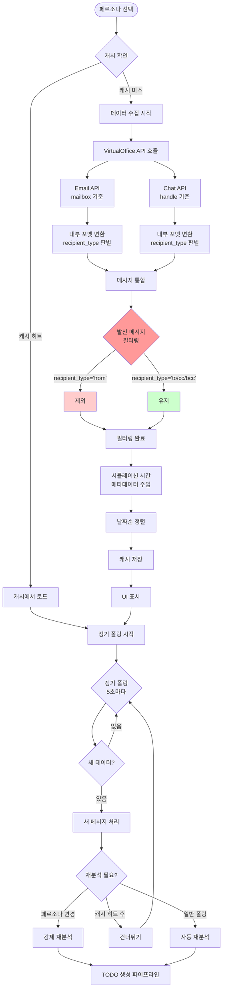
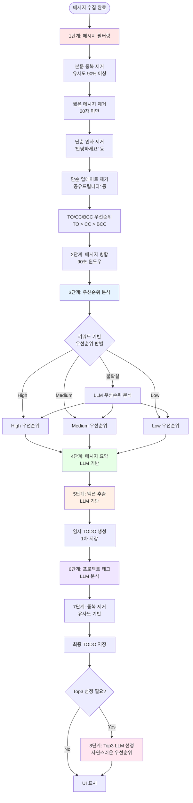
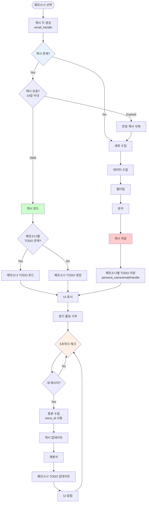
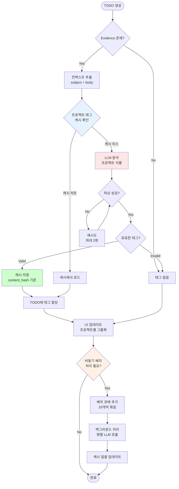
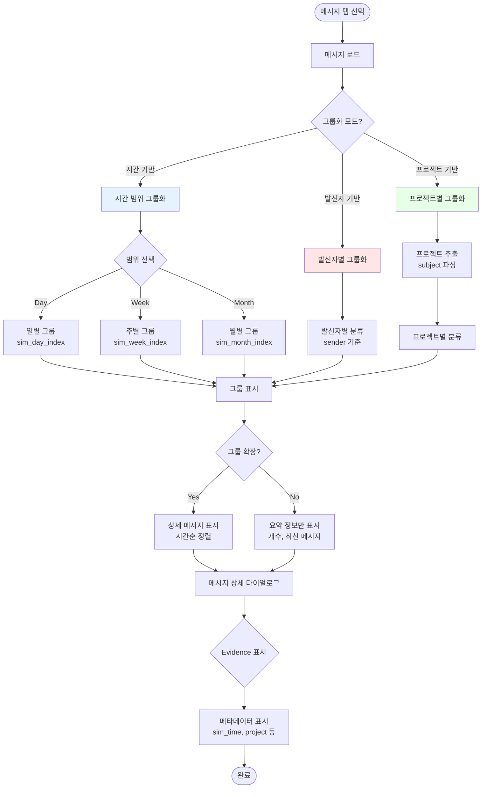
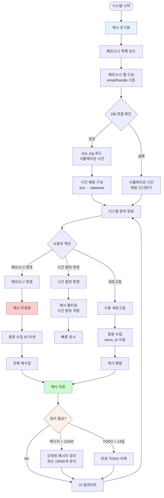
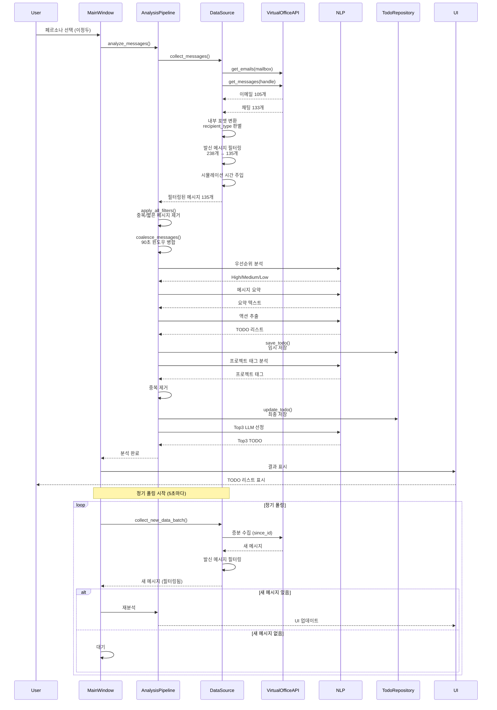
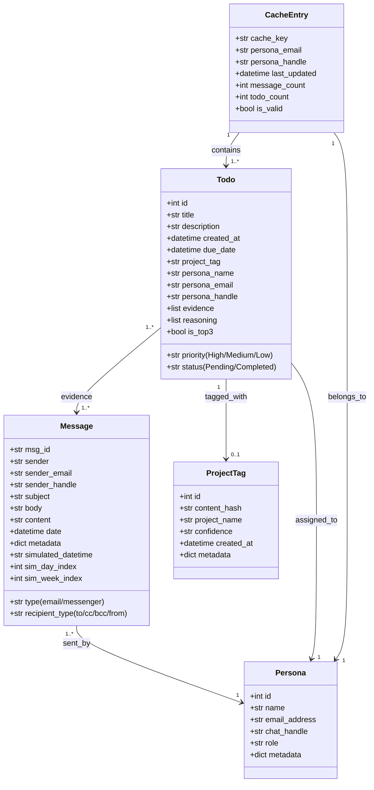

# Offline Agent 아키텍처 (11/17 업데이트)

## 전체 시스템 아키텍처

## 데이터 수집 및 필터링 플로우

## TODO 생성 파이프라인

## 페르소나별 캐싱 시스템

## 프로젝트 태그 시스템

## 메시지 그룹화 시스템

## 캐시 및 성능 최적화

## 주요 컴포넌트 상호작용

## 핵심 데이터 구조

## 성능 최적화 포인트

1. **데이터 수집 최적화**
   - 병렬 API 호출 (이메일 + 채팅 동시 수집)
   - 증분 수집 (since_id 사용)
   - 발신 메시지 조기 필터링 (238개 → 135개)

2. **캐싱 전략**
   - 페르소나별 캐시 (14일 TTL)
   - 프로젝트 태그 캐시 (content_hash 기반)
   - 시뮬레이션 상태 캐시 (2초 TTL)

3. **메모리 관리**
   - 메시지 캐시 자동 정리 (최대 10,000개)
   - TODO 자동 삭제 (14일 경과)
   - 만료 캐시 정리

4. **LLM 호출 최적화**
   - 키워드 기반 우선순위 판별 (LLM 호출 감소)
   - 배치 처리 (프로젝트 태그 10개씩)
   - 비동기 백그라운드 처리

5. **UI 반응성**
   - 임시 TODO 즉시 표시 (1차 저장)
   - 백그라운드 LLM 분석 (2차 업데이트)
   - 정기 폴링 (5초 간격)
