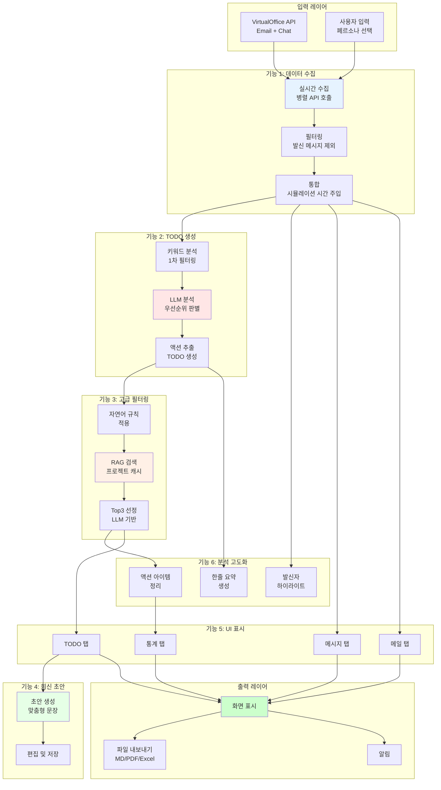

# Offline Agent 핵심 기능 플로우 다이어그램 (11/17 업데이트)

## 📋 목차

이 문서는 Offline Agent의 6가지 핵심 기능에 대한 상세한 Mermaid 플로우 다이어그램을 제공합니다.

### 핵심 기능

1. **[메시지/메일 통합 분석](FEATURE_1_MESSAGE_INTEGRATION.md)**
   - 실시간 API 데이터 수집 및 통합
   - 일일/주간/월간 요약 자동 생성

2. **[TODO 리스트 자동 생성](FEATURE_2_TODO_GENERATION.md)**
   - 키워드 기반 1차 필터링 + LLM 상세 분석 2단계 구조
   - 긴급도·발신자·데드라인·요청 강도 등 다양한 요소 반영
   - Action Required 판단 기능

3. **[고급 필터링 (자연어 규칙 + RAG)](FEATURE_3_ADVANCED_FILTERING.md)**
   - 사용자 자연어 규칙 기반 TOP3 업무 자동 선정
   - 프로젝트 캐시 + RAG 데이터 참조로 정확도 향상
   - 프로젝트 태그 자동 생성

4. **[회신 초안 자동 작성](FEATURE_4_REPLY_DRAFT.md)**
   - TODO 상세 페이지에서 자동 요약 + 회신 초안 생성
   - 요청자·맥락·데드라인 기반 맞춤형 문장 생성

5. **[UI 편의 기능 (PyQt6)](FEATURE_5_UI_FEATURES.md)**
   - 메시지/메일 탭 분리
   - 자동 새로고침, 프로젝트별 태그 관리
   - 통계 탭 (수신/우선순위/프로젝트 통계)

6. **[분석·요약 기능 고도화](FEATURE_6_ANALYSIS_SUMMARY.md)**
   - 발신자 하이라이트
   - 한줄 요약 자동 제공
   - 액션 아이템 정리 + 다운로드 가능

---

## 🔄 전체 시스템 통합 플로우

---

## 📊 기능별 상세 문서

각 기능의 상세한 플로우 다이어그램은 개별 문서를 참조하세요:

- **[FEATURE_1_MESSAGE_INTEGRATION.md](FEATURE_1_MESSAGE_INTEGRATION.md)** - 메시지/메일 통합 분석
- **[FEATURE_2_TODO_GENERATION.md](FEATURE_2_TODO_GENERATION.md)** - TODO 리스트 자동 생성
- **[FEATURE_3_ADVANCED_FILTERING.md](FEATURE_3_ADVANCED_FILTERING.md)** - 고급 필터링 (자연어 규칙 + RAG)
- **[FEATURE_4_REPLY_DRAFT.md](FEATURE_4_REPLY_DRAFT.md)** - 회신 초안 자동 작성
- **[FEATURE_5_UI_FEATURES.md](FEATURE_5_UI_FEATURES.md)** - UI 편의 기능 (PyQt6)
- **[FEATURE_6_ANALYSIS_SUMMARY.md](FEATURE_6_ANALYSIS_SUMMARY.md)** - 분석·요약 기능 고도화

---

## 🎯 핵심 특징

### 1. 실시간 처리
- 5초 간격 자동 폴링
- 증분 수집 (since_id 사용)
- 즉시 UI 업데이트

### 2. 지능형 분석
- 키워드 + LLM 2단계 분석
- RAG 기반 컨텍스트 참조
- 자연어 규칙 적용

### 3. 사용자 중심 UI
- PyQt6 기반 데스크톱 앱
- 탭별 정보 분리
- 실시간 알림 및 하이라이트

### 4. 확장 가능한 구조
- 모듈화된 서비스 레이어
- 캐싱 시스템 (14일 TTL)
- 배치 처리 지원

---

## 📈 성능 최적화

1. **병렬 API 호출** - 이메일 + 채팅 동시 수집
2. **조기 필터링** - 발신 메시지 즉시 제외 (238개 → 135개)
3. **캐싱 전략** - 페르소나별, 프로젝트별 캐시
4. **배치 처리** - LLM 호출 10개씩 묶음
5. **비동기 처리** - 백그라운드 분석

---

## 🔧 기술 스택

- **UI**: PyQt6
- **LLM**: OpenAI GPT-4o
- **DB**: SQLite (todos_cache.db, project_tags_cache.db)
- **API**: VirtualOffice REST API
- **언어**: Python 3.10+

---

## 📝 업데이트 이력

- **2025-11-17**: 페르소나별 메시지 필터링 버그 수정, 발신 메시지 제외 로직 추가
- **2025-11-17**: 핵심 기능 플로우 다이어그램 작성

---

## 📞 문의

문서 관련 문의사항이나 개선 제안은 이슈로 등록해주세요.
