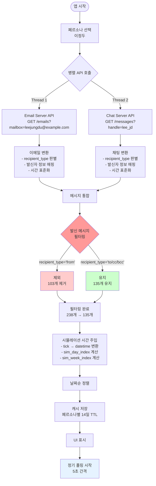
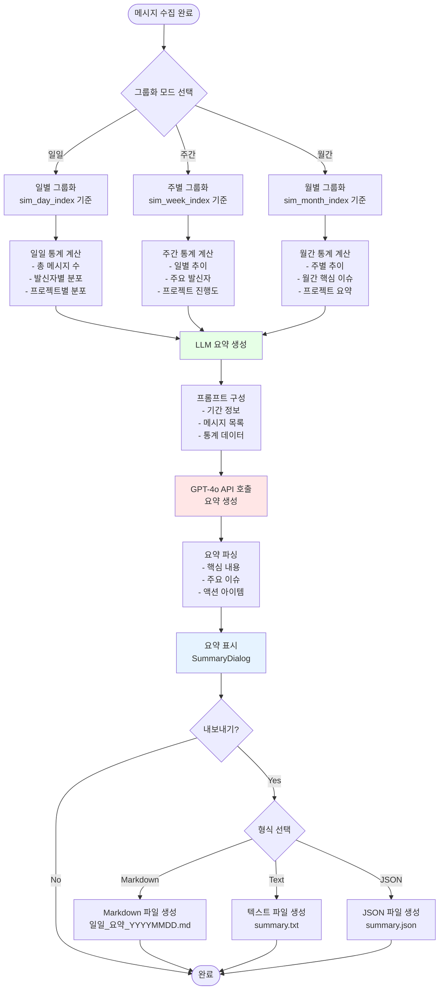

# 기능 1: 메시지/메일 통합 분석

## 실시간 API 데이터 수집 및 통합

```mermaid
flowchart TD
    Start([앱 시작]) --> SelectPersona[페르소나 선택<br/>이정두]
    
    SelectPersona --> ParallelAPI{병렬 API 호출}
    
    ParallelAPI -->|Thread 1| EmailAPI[Email Server API<br/>GET /emails?mailbox=leejungdu@example.com]
    ParallelAPI -->|Thread 2| ChatAPI[Chat Server API<br/>GET /messages?handle=lee_jd]
    
    EmailAPI --> EmailConvert[이메일 변환<br/>- recipient_type 판별<br/>- 발신자 정보 매핑<br/>- 시간 표준화]
    ChatAPI --> ChatConvert[채팅 변환<br/>- recipient_type 판별<br/>- 발신자 정보 매핑<br/>- 시간 표준화]
    
    EmailConvert --> Merge[메시지 통합]
    ChatConvert --> Merge
    
    Merge --> FilterSent{발신 메시지<br/>필터링}
    
    FilterSent -->|recipient_type='from'| Remove[제외<br/>103개 제거]
    FilterSent -->|recipient_type='to/cc/bcc'| Keep[유지<br/>135개 유지]
    
    Remove --> Filtered
    Keep --> Filtered[필터링 완료<br/>238개 → 135개]
    
    Filtered --> SimTime[시뮬레이션 시간 주입<br/>- tick → datetime 변환<br/>- sim_day_index 계산<br/>- sim_week_index 계산]
    
    SimTime --> Sort[날짜순 정렬]
    Sort --> Cache[캐시 저장<br/>페르소나별 14일 TTL]
    Cache --> Display[UI 표시]
    
    Display --> Polling[정기 폴링 시작<br/>5초 간격]
    
    style FilterSent fill:#ff9999
    style Remove fill:#ffcccc
    style Keep fill:#ccffcc
    style Polling fill:#e6f3ff
```

## 일일/주간/월간 요약 자동 생성

```mermaid
flowchart TD
    Start([메시지 수집 완료]) --> GroupingMode{그룹화 모드 선택}
    
    GroupingMode -->|일일| DailyGroup[일별 그룹화<br/>sim_day_index 기준]
    GroupingMode -->|주간| WeeklyGroup[주별 그룹화<br/>sim_week_index 기준]
    GroupingMode -->|월간| MonthlyGroup[월별 그룹화<br/>sim_month_index 기준]
    
    DailyGroup --> DailyStats[일일 통계 계산<br/>- 총 메시지 수<br/>- 발신자별 분포<br/>- 프로젝트별 분포]
    WeeklyGroup --> WeeklyStats[주간 통계 계산<br/>- 일별 추이<br/>- 주요 발신자<br/>- 프로젝트 진행도]
    MonthlyGroup --> MonthlyStats[월간 통계 계산<br/>- 주별 추이<br/>- 월간 핵심 이슈<br/>- 프로젝트 요약]
    
    DailyStats --> LLMSummary[LLM 요약 생성]
    WeeklyStats --> LLMSummary
    MonthlyStats --> LLMSummary
    
    LLMSummary --> SummaryPrompt[프롬프트 구성<br/>- 기간 정보<br/>- 메시지 목록<br/>- 통계 데이터]
    
    SummaryPrompt --> GPT4[GPT-4o API 호출<br/>요약 생성]
    
    GPT4 --> ParseSummary[요약 파싱<br/>- 핵심 내용<br/>- 주요 이슈<br/>- 액션 아이템]
    
    ParseSummary --> DisplaySummary[요약 표시<br/>SummaryDialog]
    
    DisplaySummary --> ExportOption{내보내기?}
    
    ExportOption -->|Yes| ExportFormat{형식 선택}
    ExportOption -->|No| End
    
    ExportFormat -->|Markdown| ExportMD[Markdown 파일 생성<br/>일일_요약_YYYYMMDD.md]
    ExportFormat -->|Text| ExportTXT[텍스트 파일 생성<br/>summary.txt]
    ExportFormat -->|JSON| ExportJSON[JSON 파일 생성<br/>summary.json]
    
    ExportMD --> End([완료])
    ExportTXT --> End
    ExportJSON --> End
    
    style LLMSummary fill:#e6ffe6
    style GPT4 fill:#ffe6e6
    style DisplaySummary fill:#e6f3ff
```
