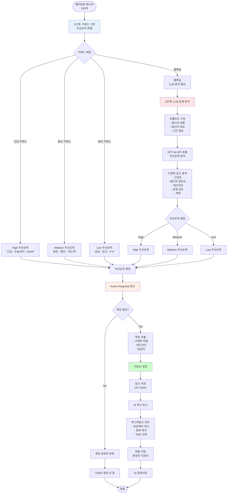
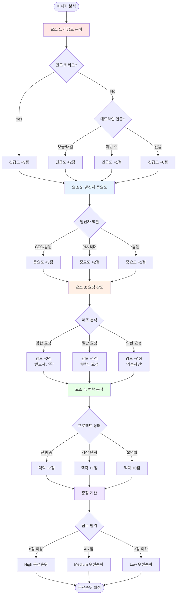

# 기능 2: TODO 리스트 자동 생성

## 2단계 구조: 키워드 기반 1차 필터링 + LLM 상세 분석

```mermaid
flowchart TD
    Start([필터링된 메시지<br/>135개]) --> Stage1[1단계: 키워드 기반<br/>우선순위 판별]
    
    Stage1 --> KeywordCheck{키워드 매칭}
    
    KeywordCheck -->|긴급 키워드| HighKeyword[High 우선순위<br/>'긴급', '오늘까지', 'ASAP']
    KeywordCheck -->|중요 키워드| MediumKeyword[Medium 우선순위<br/>'검토', '확인', '피드백']
    KeywordCheck -->|일반 키워드| LowKeyword[Low 우선순위<br/>'공유', '참고', 'FYI']
    KeywordCheck -->|불확실| Uncertain[불확실<br/>LLM 분석 필요]
    
    HighKeyword --> Merge1[우선순위 확정]
    MediumKeyword --> Merge1
    LowKeyword --> Merge1
    
    Uncertain --> Stage2[2단계: LLM 상세 분석]
    
    Stage2 --> LLMPrompt[프롬프트 구성<br/>- 메시지 내용<br/>- 발신자 정보<br/>- 시간 정보]
    
    LLMPrompt --> GPT4[GPT-4o API 호출<br/>우선순위 분석]
    
    GPT4 --> AnalyzeFactors[다양한 요소 분석<br/>- 긴급도<br/>- 발신자 중요도<br/>- 데드라인<br/>- 요청 강도<br/>- 맥락]
    
    AnalyzeFactors --> DeterminePriority{우선순위 결정}
    
    DeterminePriority -->|High| HighLLM[High 우선순위]
    DeterminePriority -->|Medium| MediumLLM[Medium 우선순위]
    DeterminePriority -->|Low| LowLLM[Low 우선순위]
    
    HighLLM --> Merge1
    MediumLLM --> Merge1
    LowLLM --> Merge1
    
    Merge1 --> ActionRequired[Action Required 판단]
    
    ActionRequired --> CheckAction{액션 필요?}
    
    CheckAction -->|Yes| ExtractAction[액션 추출<br/>- 구체적 작업<br/>- 데드라인<br/>- 담당자]
    CheckAction -->|No| MarkInfo[정보 공유로 분류]
    
    ExtractAction --> CreateTodo[TODO 생성]
    MarkInfo --> Skip[TODO 생성 안 함]
    
    CreateTodo --> TempSave[임시 저장<br/>1차 TODO]
    
    TempSave --> Display[UI 즉시 표시]
    
    Display --> Background[백그라운드 처리<br/>- 프로젝트 태그<br/>- 중복 제거<br/>- Top3 선정]
    
    Background --> FinalSave[최종 저장<br/>완성된 TODO]
    
    FinalSave --> UpdateUI[UI 업데이트]
    
    Skip --> End([완료])
    UpdateUI --> End
    
    style Stage1 fill:#e6f3ff
    style Stage2 fill:#ffe6e6
    style ActionRequired fill:#fff0e6
    style CreateTodo fill:#ccffcc
```

## 다양한 요소 반영 상세 플로우

```mermaid
flowchart TD
    Start([메시지 분석]) --> Factor1[요소 1: 긴급도 분석]
    
    Factor1 --> CheckUrgent{긴급 키워드?}
    CheckUrgent -->|Yes| UrgentScore[긴급도 +3점]
    CheckUrgent -->|No| CheckDeadline{데드라인 언급?}
    
    CheckDeadline -->|오늘/내일| DeadlineHigh[긴급도 +2점]
    CheckDeadline -->|이번 주| DeadlineMed[긴급도 +1점]
    CheckDeadline -->|없음| DeadlineLow[긴급도 +0점]
    
    UrgentScore --> Factor2
    DeadlineHigh --> Factor2
    DeadlineMed --> Factor2
    DeadlineLow --> Factor2
    
    Factor2[요소 2: 발신자 중요도] --> CheckSender{발신자 역할}
    
    CheckSender -->|CEO/임원| SenderHigh[중요도 +3점]
    CheckSender -->|PM/리더| SenderMed[중요도 +2점]
    CheckSender -->|팀원| SenderLow[중요도 +1점]
    
    SenderHigh --> Factor3
    SenderMed --> Factor3
    SenderLow --> Factor3
    
    Factor3[요소 3: 요청 강도] --> CheckTone{어조 분석}
    
    CheckTone -->|강한 요청| ToneStrong[강도 +2점<br/>'반드시', '꼭']
    CheckTone -->|일반 요청| ToneNormal[강도 +1점<br/>'부탁', '요청']
    CheckTone -->|약한 요청| ToneWeak[강도 +0점<br/>'가능하면']
    
    ToneStrong --> Factor4
    ToneNormal --> Factor4
    ToneWeak --> Factor4
    
    Factor4[요소 4: 맥락 분석] --> CheckContext{프로젝트 상태}
    
    CheckContext -->|진행 중| ContextActive[맥락 +2점]
    CheckContext -->|시작 단계| ContextNew[맥락 +1점]
    CheckContext -->|불명확| ContextUnknown[맥락 +0점]
    
    ContextActive --> Calculate
    ContextNew --> Calculate
    ContextUnknown --> Calculate
    
    Calculate[총점 계산] --> ScoreRange{점수 범위}
    
    ScoreRange -->|8점 이상| FinalHigh[High 우선순위]
    ScoreRange -->|4-7점| FinalMed[Medium 우선순위]
    ScoreRange -->|3점 이하| FinalLow[Low 우선순위]
    
    FinalHigh --> Result([우선순위 확정])
    FinalMed --> Result
    FinalLow --> Result
    
    style Factor1 fill:#ffe6e6
    style Factor2 fill:#e6f3ff
    style Factor3 fill:#fff0e6
    style Factor4 fill:#e6ffe6
    style Calculate fill:#f0e6ff
```
