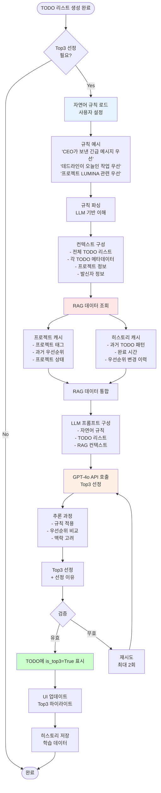
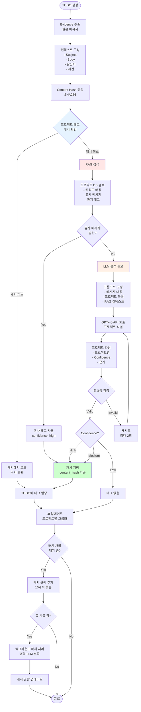

# 기능 3: 고급 필터링 (자연어 규칙 + RAG)

## 자연어 규칙 기반 TOP3 업무 자동 선정

```mermaid
flowchart TD
    Start([TODO 리스트 생성 완료]) --> CheckTop3{Top3 선정<br/>필요?}
    
    CheckTop3 -->|No| End([완료])
    CheckTop3 -->|Yes| LoadRules[자연어 규칙 로드<br/>사용자 설정]
    
    LoadRules --> RuleExample[규칙 예시<br/>'CEO가 보낸 긴급 메시지 우선'<br/>'데드라인이 오늘인 작업 우선'<br/>'프로젝트 LUMINA 관련 우선']
    
    RuleExample --> ParseRules[규칙 파싱<br/>LLM 기반 이해]
    
    ParseRules --> BuildContext[컨텍스트 구성<br/>- 전체 TODO 리스트<br/>- 각 TODO 메타데이터<br/>- 프로젝트 정보<br/>- 발신자 정보]
    
    BuildContext --> RAGQuery[RAG 데이터 조회]
    
    RAGQuery --> ProjectCache[프로젝트 캐시<br/>- 프로젝트 태그<br/>- 과거 우선순위<br/>- 프로젝트 상태]
    
    RAGQuery --> HistoryCache[히스토리 캐시<br/>- 과거 TODO 패턴<br/>- 완료 시간<br/>- 우선순위 변경 이력]
    
    ProjectCache --> MergeRAG[RAG 데이터 통합]
    HistoryCache --> MergeRAG
    
    MergeRAG --> LLMPrompt[LLM 프롬프트 구성<br/>- 자연어 규칙<br/>- TODO 리스트<br/>- RAG 컨텍스트]
    
    LLMPrompt --> GPT4[GPT-4o API 호출<br/>Top3 선정]
    
    GPT4 --> Reasoning[추론 과정<br/>- 규칙 적용<br/>- 우선순위 비교<br/>- 맥락 고려]
    
    Reasoning --> SelectTop3[Top3 선정<br/>+ 선정 이유]
    
    SelectTop3 --> Validate{검증}
    
    Validate -->|유효| MarkTop3[TODO에 is_top3=True 표시]
    Validate -->|무효| Retry[재시도<br/>최대 2회]
    
    Retry --> GPT4
    
    MarkTop3 --> UpdateUI[UI 업데이트<br/>Top3 하이라이트]
    
    UpdateUI --> SaveHistory[히스토리 저장<br/>학습 데이터]
    
    SaveHistory --> End
    
    style LoadRules fill:#e6f3ff
    style RAGQuery fill:#ffe6e6
    style GPT4 fill:#fff0e6
    style MarkTop3 fill:#ccffcc
```

## 프로젝트 태그 자동 생성 (RAG 기반)

```mermaid
flowchart TD
    Start([TODO 생성]) --> ExtractEvidence[Evidence 추출<br/>원본 메시지]
    
    ExtractEvidence --> BuildContext[컨텍스트 구성<br/>- Subject<br/>- Body<br/>- 발신자<br/>- 시간]
    
    BuildContext --> HashContent[Content Hash 생성<br/>SHA256]
    
    HashContent --> CheckCache{프로젝트 태그<br/>캐시 확인}
    
    CheckCache -->|캐시 히트| LoadCached[캐시에서 로드<br/>즉시 반환]
    CheckCache -->|캐시 미스| RAGSearch[RAG 검색]
    
    RAGSearch --> SearchProject[프로젝트 DB 검색<br/>- 키워드 매칭<br/>- 유사 메시지<br/>- 과거 태그]
    
    SearchProject --> FindSimilar{유사 메시지<br/>발견?}
    
    FindSimilar -->|Yes| UseSimilar[유사 태그 사용<br/>confidence: high]
    FindSimilar -->|No| LLMAnalysis[LLM 분석 필요]
    
    LLMAnalysis --> LLMPrompt[프롬프트 구성<br/>- 메시지 내용<br/>- 프로젝트 목록<br/>- RAG 컨텍스트]
    
    LLMPrompt --> GPT4[GPT-4o API 호출<br/>프로젝트 식별]
    
    GPT4 --> ParseProject[프로젝트 파싱<br/>- 프로젝트명<br/>- Confidence<br/>- 근거]
    
    ParseProject --> ValidateProject{유효성 검증}
    
    ValidateProject -->|Valid| ConfidenceCheck{Confidence?}
    ValidateProject -->|Invalid| RetryLLM[재시도<br/>최대 2회]
    
    RetryLLM --> GPT4
    
    ConfidenceCheck -->|High| SaveCache[캐시 저장<br/>content_hash 기준]
    ConfidenceCheck -->|Medium| SaveCache
    ConfidenceCheck -->|Low| NoTag[태그 없음]
    
    UseSimilar --> SaveCache
    LoadCached --> AssignTag
    SaveCache --> AssignTag[TODO에 태그 할당]
    
    AssignTag --> UpdateUI[UI 업데이트<br/>프로젝트별 그룹화]
    
    NoTag --> UpdateUI
    
    UpdateUI --> BatchCheck{배치 처리<br/>대기 중?}
    
    BatchCheck -->|Yes| AddQueue[배치 큐에 추가<br/>10개씩 묶음]
    BatchCheck -->|No| End([완료])
    
    AddQueue --> QueueFull{큐 가득 참?}
    
    QueueFull -->|Yes| ProcessBatch[백그라운드 배치 처리<br/>병렬 LLM 호출]
    QueueFull -->|No| End
    
    ProcessBatch --> BatchUpdate[캐시 일괄 업데이트]
    BatchUpdate --> End
    
    style CheckCache fill:#e6f3ff
    style RAGSearch fill:#ffe6e6
    style LLMAnalysis fill:#fff0e6
    style SaveCache fill:#ccffcc
```
