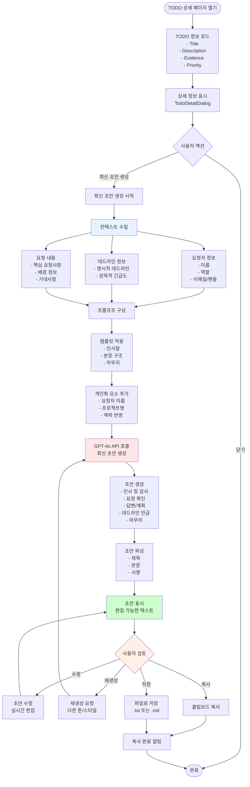

# 기능 4: 회신 초안 자동 작성

## TODO 상세 페이지에서 자동 요약 + 회신 초안 생성




## 맞춤형 회신 생성 상세 플로우

```mermaid
flowchart TD
    Start([회신 초안 생성]) --> AnalyzeRequester[요청자 분석]
    
    AnalyzeRequester --> CheckRole{요청자 역할}
    
    CheckRole -->|CEO/임원| ToneFormal[격식 있는 톤<br/>'검토하겠습니다']
    CheckRole -->|PM/리더| ToneProf[전문적인 톤<br/>'확인했습니다']
    CheckRole -->|팀원| ToneFriendly[친근한 톤<br/>'확인했어요']
    
    ToneFormal --> AnalyzeContext
    ToneProf --> AnalyzeContext
    ToneFriendly --> AnalyzeContext
    
    AnalyzeContext[맥락 분석] --> CheckUrgency{긴급도}
    
    CheckUrgency -->|High| ResponseQuick[신속 대응 강조<br/>'즉시 처리하겠습니다']
    CheckUrgency -->|Medium| ResponseNormal[일반 대응<br/>'검토 후 회신드리겠습니다']
    CheckUrgency -->|Low| ResponseRelaxed[여유 있는 대응<br/>'확인 후 공유드리겠습니다']
    
    ResponseQuick --> AnalyzeDeadline
    ResponseNormal --> AnalyzeDeadline
    ResponseRelaxed --> AnalyzeDeadline
    
    AnalyzeDeadline[데드라인 분석] --> CheckDeadline{데드라인 명시?}
    
    CheckDeadline -->|Yes| MentionDeadline[데드라인 언급<br/>'X일까지 완료하겠습니다']
    CheckDeadline -->|No| EstimateTime[예상 시간 제시<br/>'이번 주 내 완료 예정']
    
    MentionDeadline --> BuildStructure
    EstimateTime --> BuildStructure
    
    BuildStructure[구조 구성] --> Greeting[1. 인사 및 감사<br/>'안녕하세요, 메시지 감사합니다']
    
    Greeting --> Acknowledge[2. 요청 확인<br/>'X 건에 대해 확인했습니다']
    
    Acknowledge --> Response[3. 답변/계획<br/>'다음과 같이 진행하겠습니다']
    
    Response --> Timeline[4. 일정 제시<br/>'X일까지 완료 예정입니다']
    
    Timeline --> Closing[5. 마무리<br/>'추가 문의사항 있으시면 말씀해주세요']
    
    Closing --> Signature[6. 서명<br/>'감사합니다, [이름]']
    
    Signature --> FinalDraft[최종 초안 완성]
    
    FinalDraft --> QualityCheck{품질 검증}
    
    QualityCheck -->|Pass| Output[초안 출력]
    QualityCheck -->|Fail| Regenerate[재생성]
    
    Regenerate --> BuildStructure
    
    Output --> End([완료])
    
    style AnalyzeRequester fill:#e6f3ff
    style AnalyzeContext fill:#ffe6e6
    style AnalyzeDeadline fill:#fff0e6
    style BuildStructure fill:#e6ffe6
    style FinalDraft fill:#ccffcc
```
