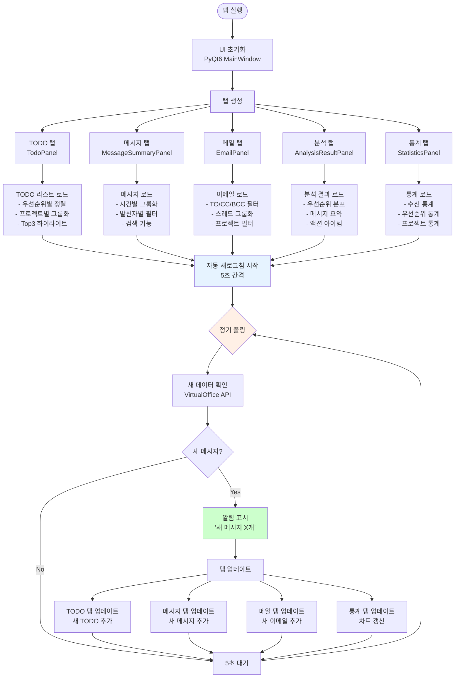
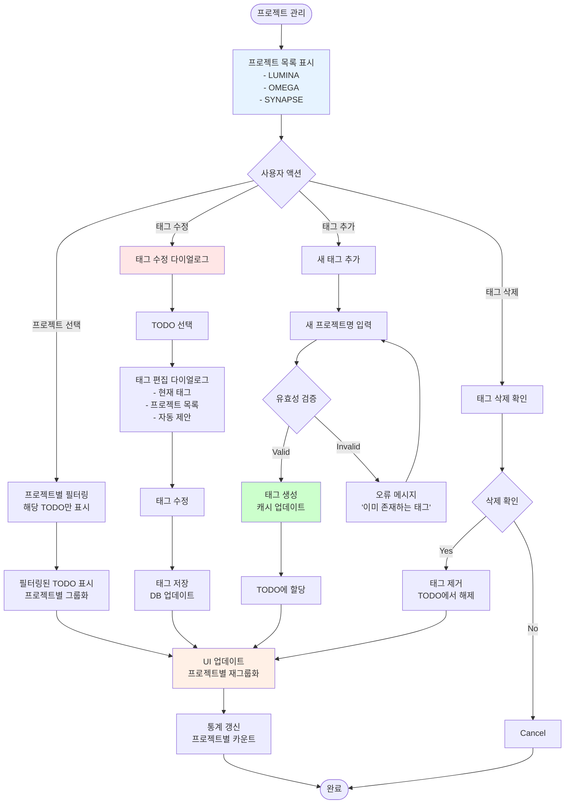
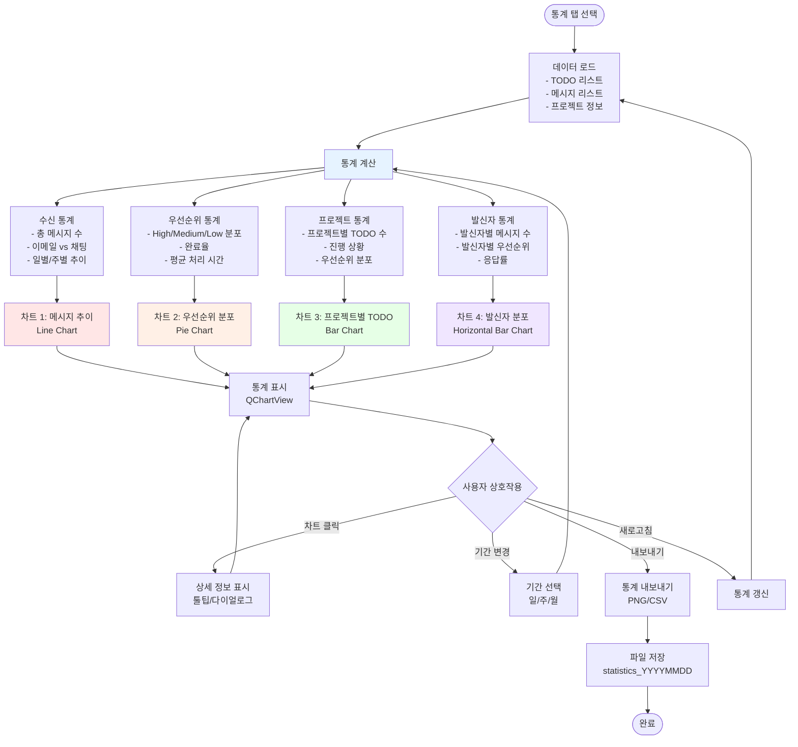

# 기능 5: UI 편의 기능 (PyQt6)

## 메시지/메일 탭 분리 및 자동 새로고침

```mermaid
flowchart TD
    Start([앱 실행]) --> InitUI[UI 초기화<br/>PyQt6 MainWindow]
    
    InitUI --> CreateTabs[탭 생성]
    
    CreateTabs --> Tab1[TODO 탭<br/>TodoPanel]
    CreateTabs --> Tab2[메시지 탭<br/>MessageSummaryPanel]
    CreateTabs --> Tab3[메일 탭<br/>EmailPanel]
    CreateTabs --> Tab4[분석 탭<br/>AnalysisResultPanel]
    CreateTabs --> Tab5[통계 탭<br/>StatisticsPanel]
    
    Tab1 --> LoadTodo[TODO 리스트 로드<br/>- 우선순위별 정렬<br/>- 프로젝트별 그룹화<br/>- Top3 하이라이트]
    
    Tab2 --> LoadMessages[메시지 로드<br/>- 시간별 그룹화<br/>- 발신자별 필터<br/>- 검색 기능]
    
    Tab3 --> LoadEmails[이메일 로드<br/>- TO/CC/BCC 필터<br/>- 스레드 그룹화<br/>- 프로젝트 필터]
    
    Tab4 --> LoadAnalysis[분석 결과 로드<br/>- 우선순위 분포<br/>- 메시지 요약<br/>- 액션 아이템]
    
    Tab5 --> LoadStats[통계 로드<br/>- 수신 통계<br/>- 우선순위 통계<br/>- 프로젝트 통계]
    
    LoadTodo --> AutoRefresh[자동 새로고침 시작<br/>5초 간격]
    LoadMessages --> AutoRefresh
    LoadEmails --> AutoRefresh
    LoadAnalysis --> AutoRefresh
    LoadStats --> AutoRefresh
    
    AutoRefresh --> PollingLoop{정기 폴링}
    
    PollingLoop --> CheckNew[새 데이터 확인<br/>VirtualOffice API]
    
    CheckNew --> HasNew{새 메시지?}
    
    HasNew -->|Yes| ShowNotification[알림 표시<br/>'새 메시지 X개']
    HasNew -->|No| Wait[5초 대기]
    
    ShowNotification --> UpdateTabs[탭 업데이트]
    
    UpdateTabs --> UpdateTodo[TODO 탭 업데이트<br/>새 TODO 추가]
    UpdateTabs --> UpdateMsg[메시지 탭 업데이트<br/>새 메시지 추가]
    UpdateTabs --> UpdateEmail[메일 탭 업데이트<br/>새 이메일 추가]
    UpdateTabs --> UpdateStats[통계 탭 업데이트<br/>차트 갱신]
    
    UpdateTodo --> Wait
    UpdateMsg --> Wait
    UpdateEmail --> Wait
    UpdateStats --> Wait
    
    Wait --> PollingLoop
    
    style AutoRefresh fill:#e6f3ff
    style ShowNotification fill:#ccffcc
    style PollingLoop fill:#fff0e6
```

## 프로젝트별 태그 관리

```mermaid
flowchart TD
    Start([프로젝트 관리]) --> ViewProjects[프로젝트 목록 표시<br/>- LUMINA<br/>- OMEGA<br/>- SYNAPSE]
    
    ViewProjects --> UserAction{사용자 액션}
    
    UserAction -->|프로젝트 선택| FilterByProject[프로젝트별 필터링<br/>해당 TODO만 표시]
    UserAction -->|태그 수정| EditTag[태그 수정 다이얼로그]
    UserAction -->|태그 추가| AddTag[새 태그 추가]
    UserAction -->|태그 삭제| DeleteTag[태그 삭제 확인]
    
    FilterByProject --> ShowFiltered[필터링된 TODO 표시<br/>프로젝트별 그룹화]
    
    EditTag --> SelectTodo[TODO 선택]
    SelectTodo --> ShowTagDialog[태그 편집 다이얼로그<br/>- 현재 태그<br/>- 프로젝트 목록<br/>- 자동 제안]
    
    ShowTagDialog --> ModifyTag[태그 수정]
    ModifyTag --> SaveTag[태그 저장<br/>DB 업데이트]
    
    AddTag --> InputNewTag[새 프로젝트명 입력]
    InputNewTag --> ValidateTag{유효성 검증}
    
    ValidateTag -->|Valid| CreateTag[태그 생성<br/>캐시 업데이트]
    ValidateTag -->|Invalid| ShowError[오류 메시지<br/>'이미 존재하는 태그']
    
    CreateTag --> AssignTag[TODO에 할당]
    ShowError --> InputNewTag
    
    DeleteTag --> ConfirmDelete{삭제 확인}
    
    ConfirmDelete -->|Yes| RemoveTag[태그 제거<br/>TODO에서 해제]
    ConfirmDelete -->|No| Cancel
    
    RemoveTag --> UpdateUI
    AssignTag --> UpdateUI
    SaveTag --> UpdateUI
    ShowFiltered --> UpdateUI
    
    UpdateUI[UI 업데이트<br/>프로젝트별 재그룹화] --> RefreshStats[통계 갱신<br/>프로젝트별 카운트]
    
    RefreshStats --> End([완료])
    Cancel --> End
    
    style ViewProjects fill:#e6f3ff
    style EditTag fill:#ffe6e6
    style CreateTag fill:#ccffcc
    style UpdateUI fill:#fff0e6
```

## 통계 탭 (수신/우선순위/프로젝트 통계)

```mermaid
flowchart TD
    Start([통계 탭 선택]) --> LoadData[데이터 로드<br/>- TODO 리스트<br/>- 메시지 리스트<br/>- 프로젝트 정보]
    
    LoadData --> Calculate[통계 계산]
    
    Calculate --> Stat1[수신 통계<br/>- 총 메시지 수<br/>- 이메일 vs 채팅<br/>- 일별/주별 추이]
    
    Calculate --> Stat2[우선순위 통계<br/>- High/Medium/Low 분포<br/>- 완료율<br/>- 평균 처리 시간]
    
    Calculate --> Stat3[프로젝트 통계<br/>- 프로젝트별 TODO 수<br/>- 진행 상황<br/>- 우선순위 분포]
    
    Calculate --> Stat4[발신자 통계<br/>- 발신자별 메시지 수<br/>- 발신자별 우선순위<br/>- 응답률]
    
    Stat1 --> Chart1[차트 1: 메시지 추이<br/>Line Chart]
    Stat2 --> Chart2[차트 2: 우선순위 분포<br/>Pie Chart]
    Stat3 --> Chart3[차트 3: 프로젝트별 TODO<br/>Bar Chart]
    Stat4 --> Chart4[차트 4: 발신자 분포<br/>Horizontal Bar Chart]
    
    Chart1 --> Display[통계 표시<br/>QChartView]
    Chart2 --> Display
    Chart3 --> Display
    Chart4 --> Display
    
    Display --> Interactive{사용자 상호작용}
    
    Interactive -->|차트 클릭| ShowDetail[상세 정보 표시<br/>툴팁/다이얼로그]
    Interactive -->|기간 변경| ChangePeriod[기간 선택<br/>일/주/월]
    Interactive -->|내보내기| Export[통계 내보내기<br/>PNG/CSV]
    Interactive -->|새로고침| Refresh[통계 갱신]
    
    ShowDetail --> Display
    ChangePeriod --> Calculate
    Export --> SaveFile[파일 저장<br/>statistics_YYYYMMDD]
    Refresh --> LoadData
    
    SaveFile --> End([완료])
    
    style Calculate fill:#e6f3ff
    style Chart1 fill:#ffe6e6
    style Chart2 fill:#fff0e6
    style Chart3 fill:#e6ffe6
    style Chart4 fill:#f0e6ff
```
