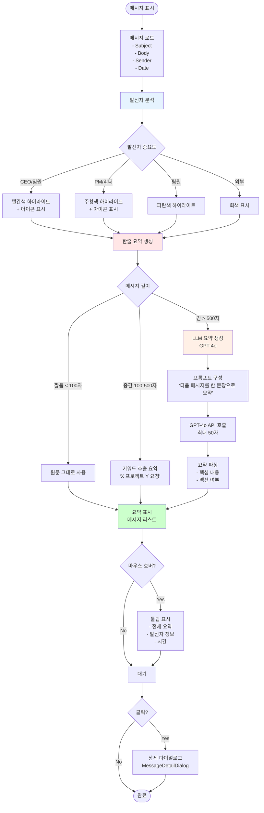
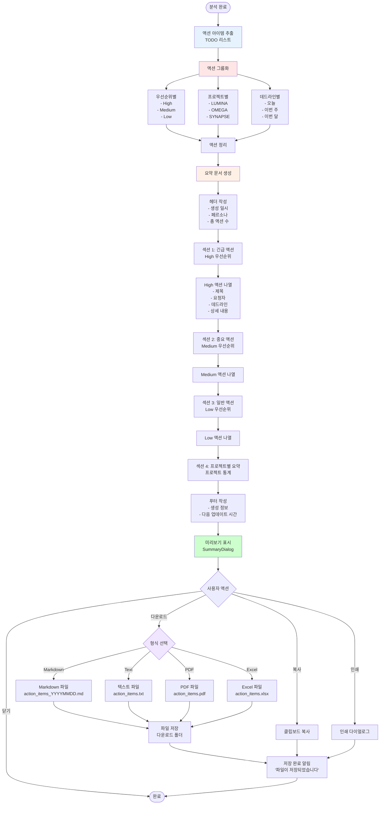
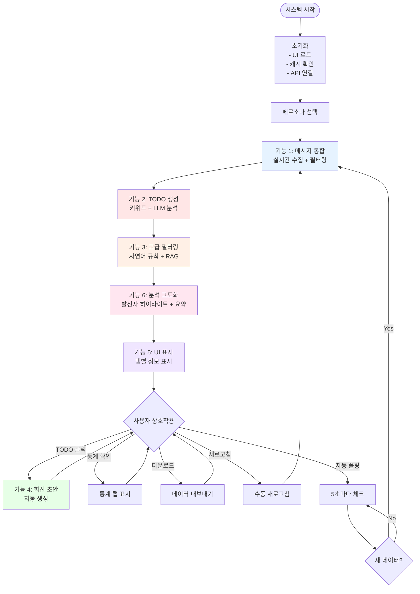

# 기능 6: 분석·요약 기능 고도화

## 발신자 하이라이트 및 한줄 요약

```mermaid
flowchart TD
    Start([메시지 표시]) --> LoadMessage[메시지 로드<br/>- Subject<br/>- Body<br/>- Sender<br/>- Date]
    
    LoadMessage --> AnalyzeSender[발신자 분석]
    
    AnalyzeSender --> CheckImportance{발신자 중요도}
    
    CheckImportance -->|CEO/임원| HighlightRed[빨간색 하이라이트<br/>+ 아이콘 표시]
    CheckImportance -->|PM/리더| HighlightOrange[주황색 하이라이트<br/>+ 아이콘 표시]
    CheckImportance -->|팀원| HighlightBlue[파란색 하이라이트]
    CheckImportance -->|외부| HighlightGray[회색 표시]
    
    HighlightRed --> GenerateSummary
    HighlightOrange --> GenerateSummary
    HighlightBlue --> GenerateSummary
    HighlightGray --> GenerateSummary
    
    GenerateSummary[한줄 요약 생성] --> CheckLength{메시지 길이}
    
    CheckLength -->|짧음 < 100자| DirectSummary[원문 그대로 사용]
    CheckLength -->|중간 100-500자| KeywordSummary[키워드 추출 요약<br/>'X 프로젝트 Y 요청']
    CheckLength -->|긴 > 500자| LLMSummary[LLM 요약 생성<br/>GPT-4o]
    
    DirectSummary --> DisplaySummary
    KeywordSummary --> DisplaySummary
    
    LLMSummary --> SummaryPrompt[프롬프트 구성<br/>'다음 메시지를 한 문장으로 요약']
    
    SummaryPrompt --> GPT4[GPT-4o API 호출<br/>최대 50자]
    
    GPT4 --> ParseSummary[요약 파싱<br/>- 핵심 내용<br/>- 액션 여부]
    
    ParseSummary --> DisplaySummary[요약 표시<br/>메시지 리스트]
    
    DisplaySummary --> UserHover{마우스 호버?}
    
    UserHover -->|Yes| ShowTooltip[툴팁 표시<br/>- 전체 요약<br/>- 발신자 정보<br/>- 시간]
    UserHover -->|No| Wait
    
    ShowTooltip --> Wait[대기]
    Wait --> UserClick{클릭?}
    
    UserClick -->|Yes| ShowDetail[상세 다이얼로그<br/>MessageDetailDialog]
    UserClick -->|No| End([완료])
    
    ShowDetail --> End
    
    style AnalyzeSender fill:#e6f3ff
    style GenerateSummary fill:#ffe6e6
    style LLMSummary fill:#fff0e6
    style DisplaySummary fill:#ccffcc
```

## 액션 아이템 정리 및 다운로드

```mermaid
flowchart TD
    Start([분석 완료]) --> ExtractActions[액션 아이템 추출<br/>TODO 리스트]
    
    ExtractActions --> GroupActions[액션 그룹화]
    
    GroupActions --> ByPriority[우선순위별<br/>- High<br/>- Medium<br/>- Low]
    
    GroupActions --> ByProject[프로젝트별<br/>- LUMINA<br/>- OMEGA<br/>- SYNAPSE]
    
    GroupActions --> ByDeadline[데드라인별<br/>- 오늘<br/>- 이번 주<br/>- 이번 달]
    
    ByPriority --> Organize
    ByProject --> Organize
    ByDeadline --> Organize
    
    Organize[액션 정리] --> CreateSummary[요약 문서 생성]
    
    CreateSummary --> Header[헤더 작성<br/>- 생성 일시<br/>- 페르소나<br/>- 총 액션 수]
    
    Header --> Section1[섹션 1: 긴급 액션<br/>High 우선순위]
    
    Section1 --> ListHigh[High 액션 나열<br/>- 제목<br/>- 요청자<br/>- 데드라인<br/>- 상세 내용]
    
    ListHigh --> Section2[섹션 2: 중요 액션<br/>Medium 우선순위]
    
    Section2 --> ListMedium[Medium 액션 나열]
    
    ListMedium --> Section3[섹션 3: 일반 액션<br/>Low 우선순위]
    
    Section3 --> ListLow[Low 액션 나열]
    
    ListLow --> Section4[섹션 4: 프로젝트별 요약<br/>프로젝트 통계]
    
    Section4 --> Footer[푸터 작성<br/>- 생성 정보<br/>- 다음 업데이트 시간]
    
    Footer --> Preview[미리보기 표시<br/>SummaryDialog]
    
    Preview --> UserAction{사용자 액션}
    
    UserAction -->|다운로드| SelectFormat{형식 선택}
    UserAction -->|복사| CopyToClipboard[클립보드 복사]
    UserAction -->|인쇄| PrintDialog[인쇄 다이얼로그]
    UserAction -->|닫기| End([완료])
    
    SelectFormat -->|Markdown| ExportMD[Markdown 파일<br/>action_items_YYYYMMDD.md]
    SelectFormat -->|Text| ExportTXT[텍스트 파일<br/>action_items.txt]
    SelectFormat -->|PDF| ExportPDF[PDF 파일<br/>action_items.pdf]
    SelectFormat -->|Excel| ExportXLSX[Excel 파일<br/>action_items.xlsx]
    
    ExportMD --> SaveFile[파일 저장<br/>다운로드 폴더]
    ExportTXT --> SaveFile
    ExportPDF --> SaveFile
    ExportXLSX --> SaveFile
    
    SaveFile --> ShowSuccess[저장 완료 알림<br/>'파일이 저장되었습니다']
    
    CopyToClipboard --> ShowSuccess
    PrintDialog --> ShowSuccess
    
    ShowSuccess --> End
    
    style ExtractActions fill:#e6f3ff
    style GroupActions fill:#ffe6e6
    style CreateSummary fill:#fff0e6
    style Preview fill:#ccffcc
    style SelectFormat fill:#f0e6ff
```

## 통합 분석 플로우 (전체 기능 연계)

```mermaid
flowchart TD
    Start([시스템 시작]) --> Init[초기화<br/>- UI 로드<br/>- 캐시 확인<br/>- API 연결]
    
    Init --> SelectPersona[페르소나 선택]
    
    SelectPersona --> Feature1[기능 1: 메시지 통합<br/>실시간 수집 + 필터링]
    
    Feature1 --> Feature2[기능 2: TODO 생성<br/>키워드 + LLM 분석]
    
    Feature2 --> Feature3[기능 3: 고급 필터링<br/>자연어 규칙 + RAG]
    
    Feature3 --> Feature6[기능 6: 분석 고도화<br/>발신자 하이라이트 + 요약]
    
    Feature6 --> Feature5[기능 5: UI 표시<br/>탭별 정보 표시]
    
    Feature5 --> UserInteraction{사용자 상호작용}
    
    UserInteraction -->|TODO 클릭| Feature4[기능 4: 회신 초안<br/>자동 생성]
    UserInteraction -->|통계 확인| ShowStats[통계 탭 표시]
    UserInteraction -->|다운로드| ExportData[데이터 내보내기]
    UserInteraction -->|새로고침| Refresh[수동 새로고침]
    
    Feature4 --> UserInteraction
    ShowStats --> UserInteraction
    ExportData --> UserInteraction
    Refresh --> Feature1
    
    UserInteraction -->|자동 폴링| AutoPoll[5초마다 체크]
    
    AutoPoll --> CheckNew{새 데이터?}
    
    CheckNew -->|Yes| Feature1
    CheckNew -->|No| AutoPoll
    
    style Feature1 fill:#e6f3ff
    style Feature2 fill:#ffe6e6
    style Feature3 fill:#fff0e6
    style Feature4 fill:#e6ffe6
    style Feature5 fill:#f0e6ff
    style Feature6 fill:#ffe6f0
```
