# Offline Agent 소프트웨어 아키텍처 (11/17 업데이트)

## C4 Model 기반 아키텍처 문서

이 문서는 C4 Model을 기반으로 Offline Agent의 소프트웨어 아키텍처를 4가지 레벨로 설명합니다.

---

## Level 1: System Context Diagram (시스템 컨텍스트)

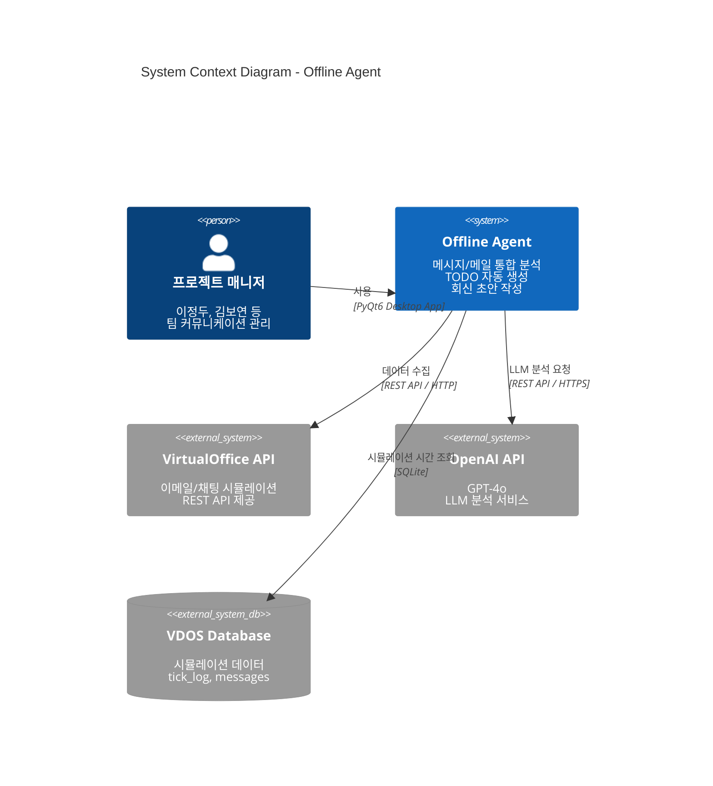

### 시스템 설명

**Offline Agent**는 프로젝트 매니저가 팀 커뮤니케이션을 효율적으로 관리할 수 있도록 돕는 데스크톱 애플리케이션입니다.

**주요 기능:**
- 이메일/채팅 메시지 통합 분석
- AI 기반 TODO 자동 생성
- 우선순위 자동 판별
- 회신 초안 자동 작성
- 프로젝트별 태그 관리

**외부 시스템:**
- **VirtualOffice API**: 시뮬레이션된 이메일/채팅 데이터 제공
- **OpenAI API**: GPT-4o를 통한 자연어 처리
- **VDOS Database**: 시뮬레이션 시간 매핑 데이터

---

## Level 2: Container Diagram (컨테이너)

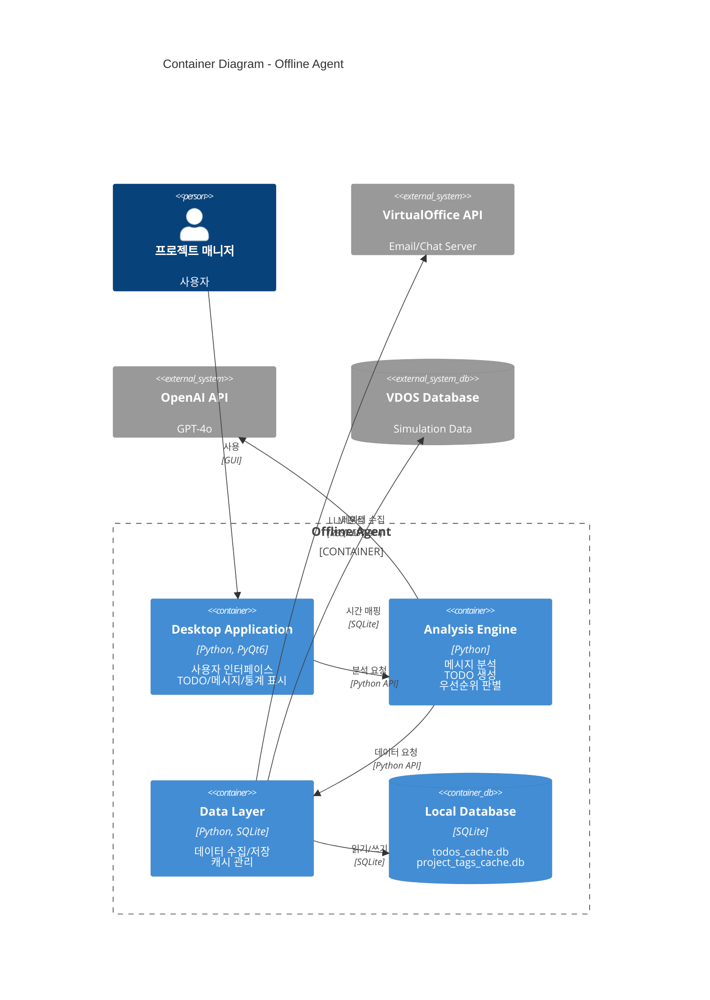

### 컨테이너 설명

1. **Desktop Application (PyQt6)**
   - 사용자 인터페이스 제공
   - TODO/메시지/메일/통계 탭 관리
   - 실시간 알림 및 업데이트

2. **Analysis Engine**
   - 메시지 분석 파이프라인
   - 우선순위 판별 (키워드 + LLM)
   - TODO 생성 및 중복 제거
   - Top3 선정

3. **Data Layer**
   - VirtualOffice API 연동
   - 데이터 수집 및 필터링
   - 캐시 관리 (14일 TTL)
   - 시뮬레이션 시간 매핑

4. **Local Database (SQLite)**
   - TODO 저장소
   - 프로젝트 태그 캐시
   - 페르소나별 캐시

---

## Level 3: Component Diagram (컴포넌트)

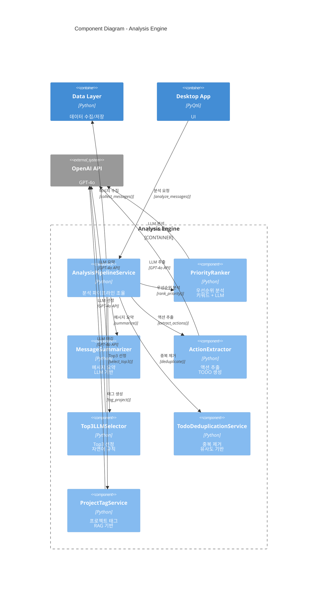

### 컴포넌트 설명

#### Analysis Engine 컴포넌트

1. **AnalysisPipelineService**
   - 전체 분석 파이프라인 조율
   - 각 컴포넌트 호출 순서 관리
   - 에러 처리 및 재시도 로직

2. **PriorityRanker**
   - 1단계: 키워드 기반 우선순위 판별
   - 2단계: LLM 기반 상세 분석
   - 긴급도, 발신자, 데드라인 등 종합 평가

3. **MessageSummarizer**
   - 메시지 요약 생성
   - 한줄 요약 (50자 이내)
   - 상세 요약 (200자 이내)

4. **ActionExtractor**
   - 액션 아이템 추출
   - TODO 생성
   - 데드라인 파싱

5. **Top3LLMSelector**
   - 자연어 규칙 적용
   - RAG 기반 컨텍스트 참조
   - Top3 TODO 선정

6. **TodoDeduplicationService**
   - 유사도 기반 중복 제거
   - 임베딩 벡터 비교
   - 중복 TODO 병합

7. **ProjectTagService**
   - 프로젝트 태그 자동 생성
   - 캐시 기반 빠른 조회
   - LLM 기반 프로젝트 식별

---

## Level 3: Component Diagram - Data Layer

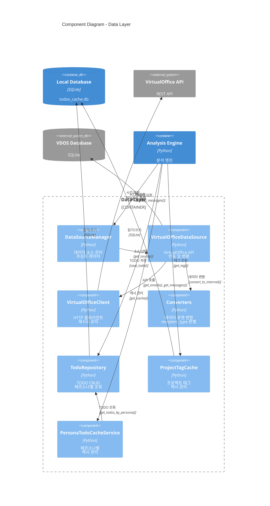

### Data Layer 컴포넌트 설명

1. **DataSourceManager**
   - 데이터 소스 추상화
   - 다중 소스 지원 (VirtualOffice, JSON 파일 등)
   - 소스 전환 로직

2. **VirtualOfficeDataSource**
   - VirtualOffice API 연동
   - 병렬 데이터 수집
   - 발신 메시지 필터링
   - 시뮬레이션 시간 주입

3. **VirtualOfficeClient**
   - HTTP 클라이언트
   - 재시도 로직 (최대 3회)
   - 타임아웃 관리 (10초)
   - 연결 풀링

4. **Converters**
   - API 응답 → 내부 포맷 변환
   - recipient_type 판별 (to/cc/bcc/from)
   - 페르소나 정보 매핑

5. **TodoRepository**
   - TODO CRUD 작업
   - 페르소나별 조회
   - 14일 자동 삭제
   - 트랜잭션 관리

6. **ProjectTagCache**
   - content_hash 기반 캐시
   - LRU 캐시 전략
   - 배치 업데이트

7. **PersonaTodoCacheService**
   - 페르소나별 캐시 관리
   - 14일 TTL
   - 캐시 무효화 로직

---

## Level 3: Component Diagram - Desktop Application

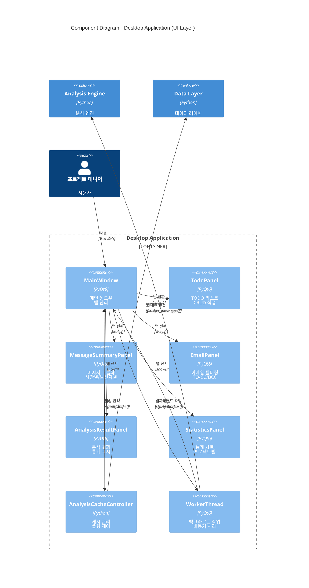

### Desktop Application 컴포넌트 설명

1. **MainWindow**
   - 메인 윈도우 관리
   - 탭 전환 로직
   - 페르소나 선택
   - 전역 상태 관리

2. **TodoPanel**
   - TODO 리스트 표시
   - 우선순위별 정렬
   - 프로젝트별 그룹화
   - Top3 하이라이트
   - CRUD 작업

3. **MessageSummaryPanel**
   - 메시지 그룹화 (시간/발신자/프로젝트)
   - 그룹 확장/축소
   - 검색 및 필터링
   - 상세 다이얼로그

4. **EmailPanel**
   - 이메일 필터링 (TO/CC/BCC)
   - 스레드 그룹화
   - 프로젝트 필터
   - 발신자 하이라이트

5. **AnalysisResultPanel**
   - 분석 결과 표시
   - 우선순위 분포
   - 메시지 요약
   - 액션 아이템

6. **StatisticsPanel**
   - 통계 차트 (Line, Pie, Bar)
   - 수신/우선순위/프로젝트 통계
   - 기간 선택
   - 내보내기 (PNG/CSV)

7. **AnalysisCacheController**
   - 캐시 확인 및 로드
   - 정기 폴링 (5초)
   - 증분 수집
   - 캐시 무효화

8. **WorkerThread**
   - 백그라운드 분석
   - UI 블로킹 방지
   - 진행 상황 알림
   - 에러 처리

---

## Level 4: Code Diagram (클래스 다이어그램)

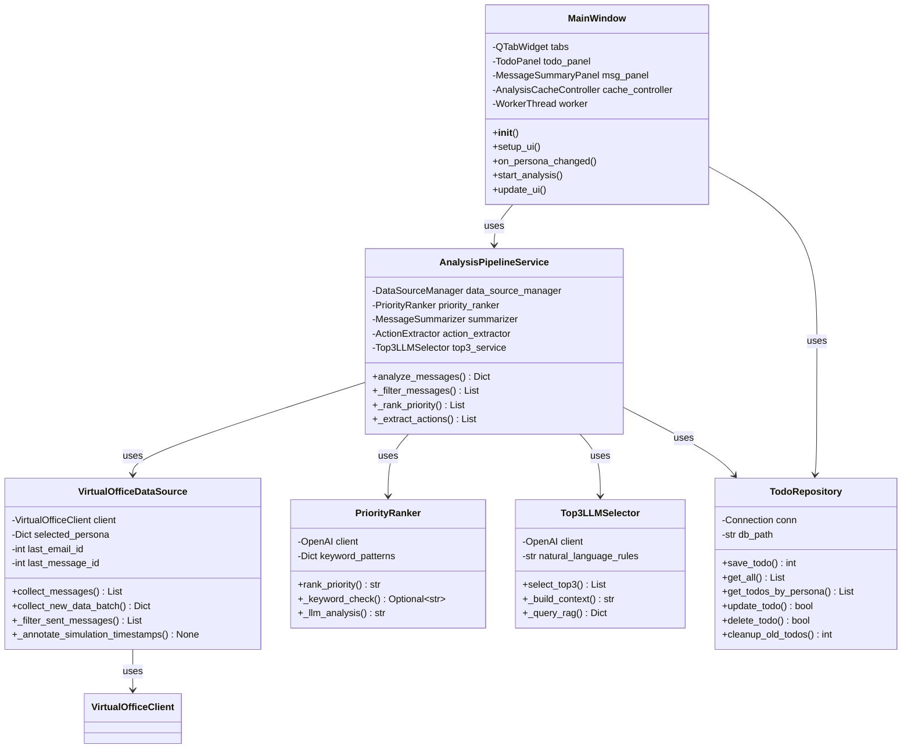

### 주요 클래스 설명

#### MainWindow
- **책임**: UI 전체 관리, 사용자 이벤트 처리
- **주요 메서드**:
  - `on_persona_changed()`: 페르소나 변경 시 캐시 확인 및 데이터 로드
  - `start_analysis()`: 백그라운드 분석 시작
  - `update_ui()`: 분석 결과로 UI 업데이트

#### AnalysisPipelineService
- **책임**: 분석 파이프라인 조율
- **주요 메서드**:
  - `analyze_messages()`: 전체 분석 파이프라인 실행
  - `_filter_messages()`: 메시지 필터링 (중복, 짧은 메시지 등)
  - `_rank_priority()`: 우선순위 판별
  - `_extract_actions()`: 액션 추출 및 TODO 생성

#### VirtualOfficeDataSource
- **책임**: VirtualOffice API 연동 및 데이터 변환
- **주요 메서드**:
  - `collect_messages()`: 전체 메시지 수집
  - `collect_new_data_batch()`: 증분 수집 (정기 폴링용)
  - `_filter_sent_messages()`: 발신 메시지 제외
  - `_annotate_simulation_timestamps()`: 시뮬레이션 시간 주입

#### TodoRepository
- **책임**: TODO 데이터 영속성 관리
- **주요 메서드**:
  - `save_todo()`: TODO 저장
  - `get_todos_by_persona()`: 페르소나별 TODO 조회
  - `cleanup_old_todos()`: 14일 경과 TODO 삭제

---

## 아키텍처 패턴

### 1. Layered Architecture (계층형 아키텍처)

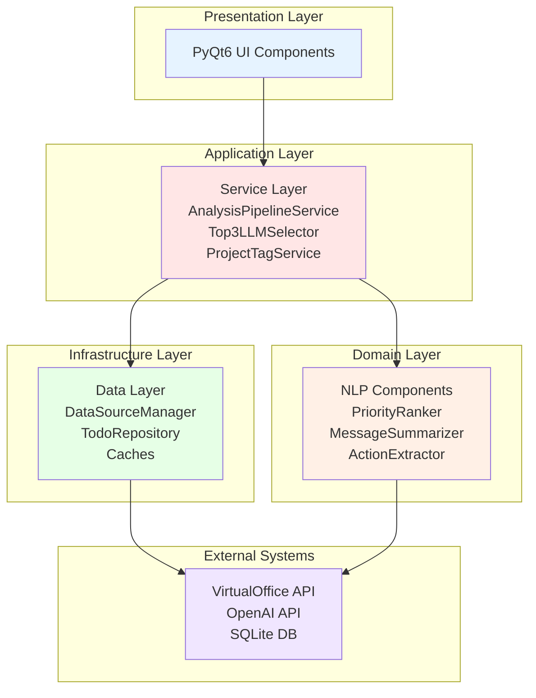

### 2. Repository Pattern (저장소 패턴)

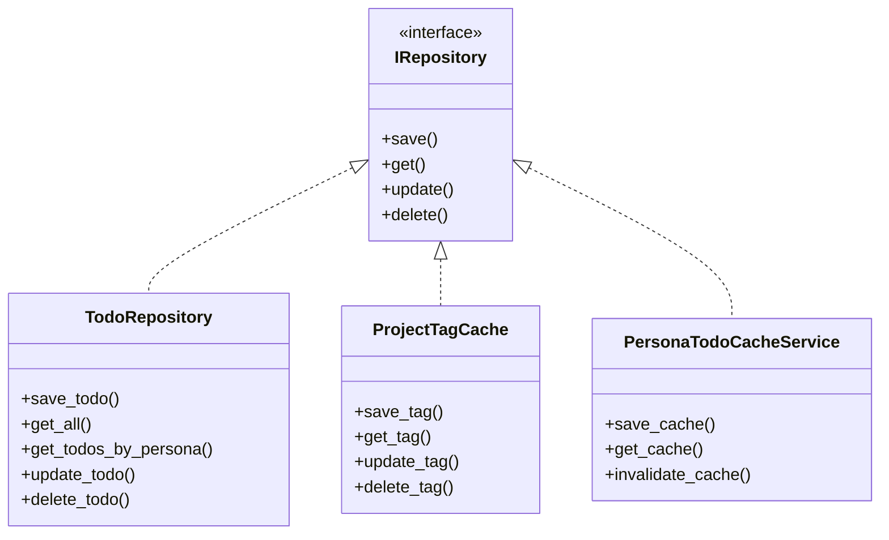

### 3. Strategy Pattern (전략 패턴)

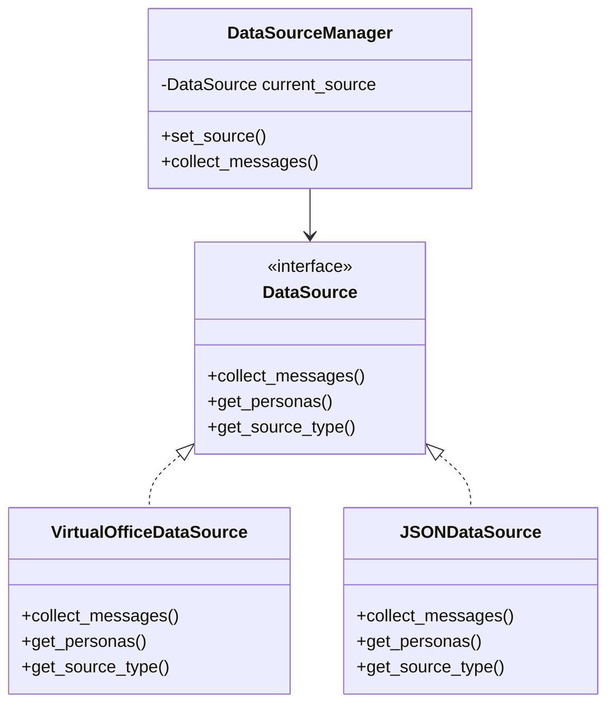

### 4. Observer Pattern (관찰자 패턴)

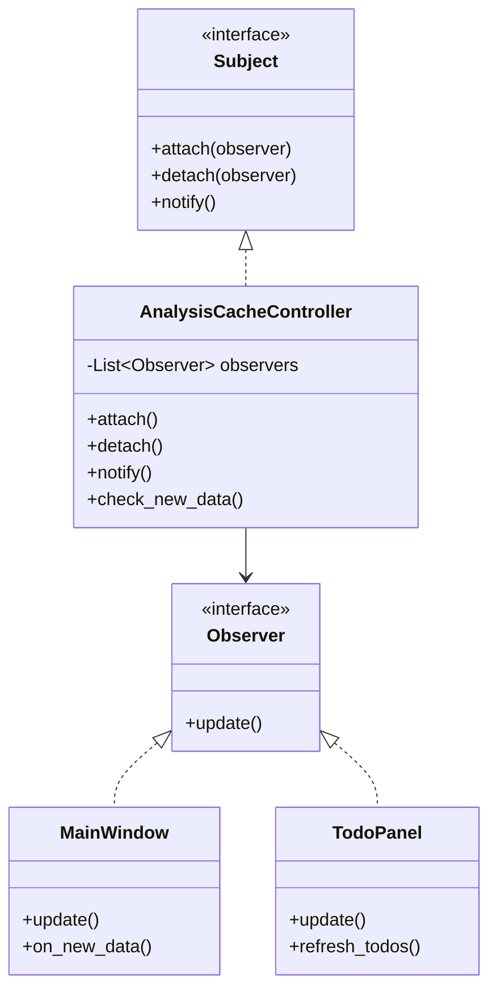

---

## 데이터 흐름 아키텍처

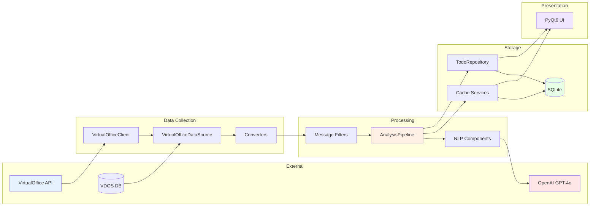

---

## 배포 아키텍처

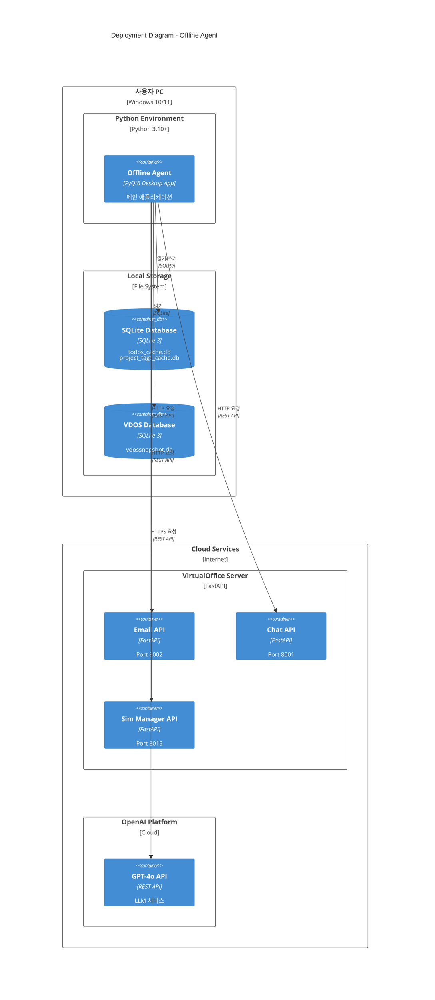

### 배포 환경

**로컬 환경:**
- Windows 10/11
- Python 3.10+
- PyQt6
- SQLite 3

**외부 서비스:**
- VirtualOffice API (로컬 또는 원격)
- OpenAI API (클라우드)

---

## 보안 아키텍처

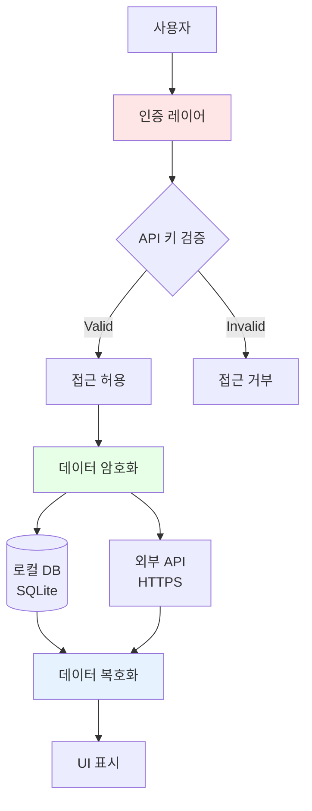

### 보안 고려사항

1. **API 키 관리**
   - 환경 변수 (.env)
   - 평문 저장 금지
   - 키 로테이션 지원

2. **데이터 보호**
   - 로컬 DB 암호화 (선택사항)
   - HTTPS 통신
   - 민감 정보 마스킹

3. **접근 제어**
   - 페르소나별 데이터 격리
   - 캐시 TTL (14일)
   - 자동 로그아웃

---

## 성능 아키텍처

### 캐싱 전략

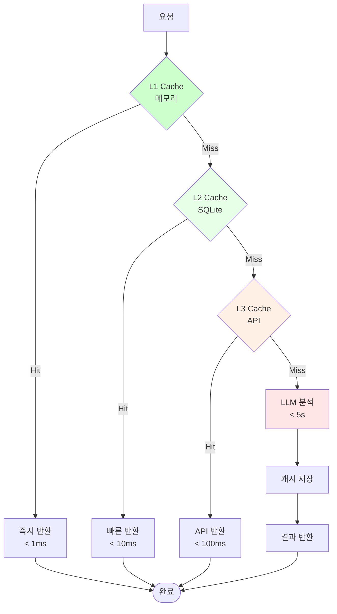

### 병렬 처리

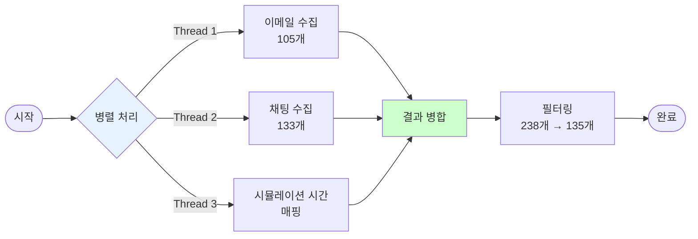

---

## 확장성 아키텍처

### 플러그인 아키텍처

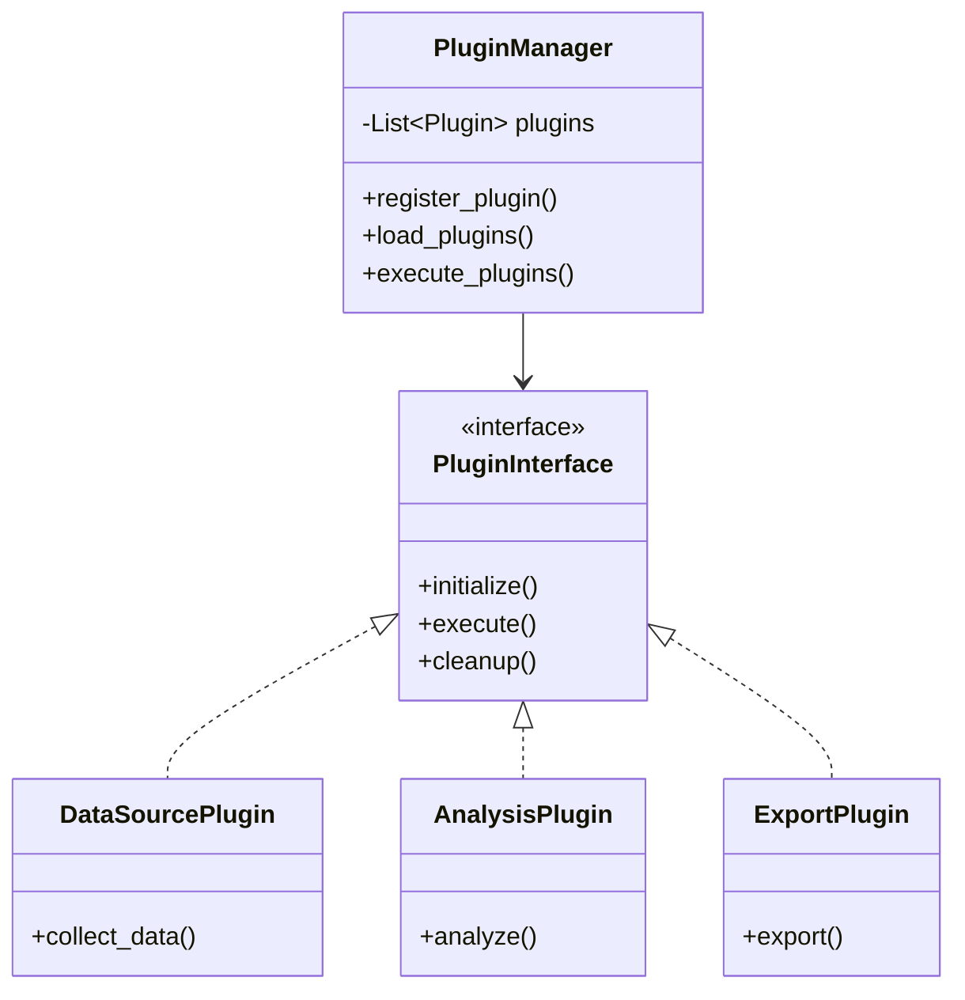

### 마이크로서비스 확장 (미래)

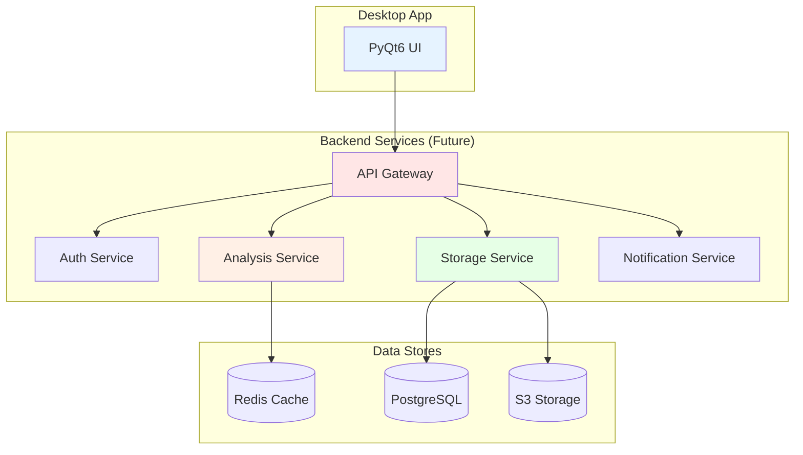

---

## 요약

이 문서는 Offline Agent의 소프트웨어 아키텍처를 C4 Model 기반으로 4가지 레벨에서 설명했습니다:

1. **System Context**: 전체 시스템과 외부 시스템의 관계
2. **Container**: 주요 컨테이너 (Desktop App, Analysis Engine, Data Layer)
3. **Component**: 각 컨테이너 내부의 컴포넌트 구조
4. **Code**: 주요 클래스 다이어그램

추가로 아키텍처 패턴, 데이터 흐름, 배포, 보안, 성능, 확장성 측면에서의 아키텍처도 다루었습니다.
